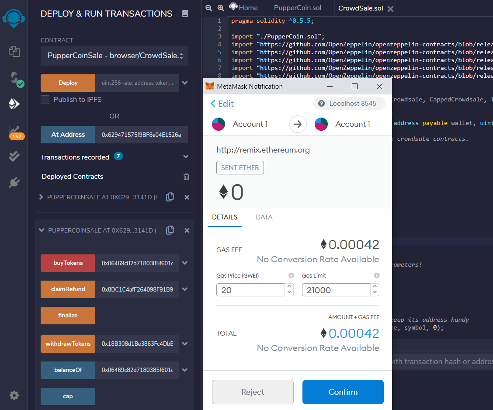

# CrowdSale.sol Design

## PupperCoin Crowdsale

First we are going to work off the PupperCoin.sol 

------

You will need to bootstrap the contract by inheriting the following OpenZeppelin contracts:

* `Crowdsale`

* `MintedCrowdsale`

* `CappedCrowdsale`

* `TimedCrowdsale`

* `RefundablePostDeliveryCrowdsale`

-----

## Testing the Crowdsale

Test the crowdsale by sending Ether to the crowdsale from a different account. You can see below how the contract was deployed and the different addresses used are filled in to the deployment.

-----

## Transacting the Crowdsale

After deploying the contract, it was time to run a test and make sure the Transaction was successful. 

